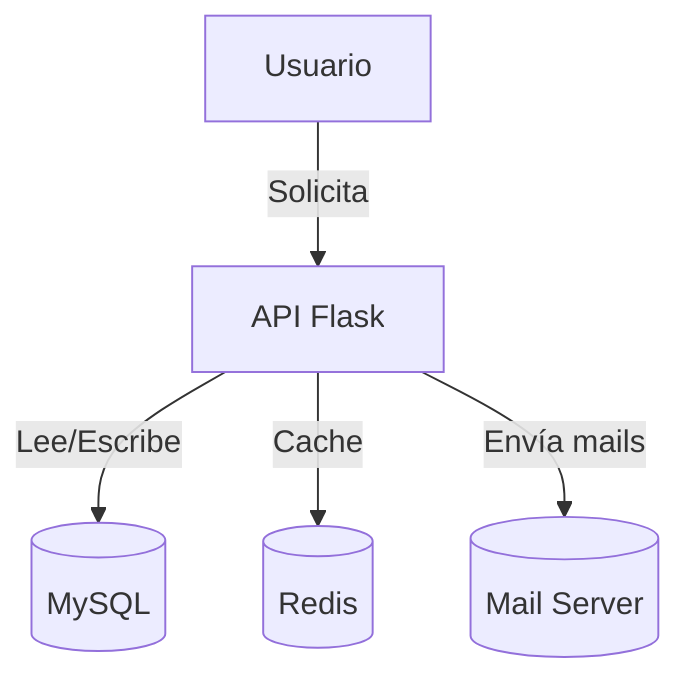

# Backend para Proyecto de APP Web CRM

Este repositorio implementa el backend de un sistema de gestión para institutos de idiomas. Está desarrollado en Python utilizando **Flask**, con APIs RESTful, JWT para autenticación, integración con MySQL y Redis, modularidad con blueprints, gestión de mails y despliegue listo para Docker. Es una solución robusta para la administración académica y operativa.

---

## Tabla de Contenidos

- [Tecnologías y Librerías](#tecnologías-y-librerías)
- [Estructura del Proyecto](#estructura-del-proyecto)
- [Configuración y Variables de Entorno](#configuración-y-variables-de-entorno)
- [Ejecución y Despliegue](#ejecución-y-despliegue)
- [Endpoints Detallados](#endpoints-detallados)
- [Modelos y Esquemas](#modelos-y-esquemas)
- [Servicios Destacados](#servicios-destacados)
- [Pruebas Locales](#pruebas-locales)
- [Autor](#autor)
- [Diagramas y Flujos](#diagramas-y-flujos)

---

## Tecnologías y Librerías

**Backend y Frameworks**
- Python 3.8.10
- Flask 2.3.2
- Flask-RESTful (APIs REST)
- Flask-JWT-Extended (Autenticación JWT)
- Flask-Mail (envío de correos)
- Flask-Migrate (migraciones de base de datos)
- Flask-SQLAlchemy (ORM)
- Flask-CORS (CORS)

**Serialización y Validación**
- Marshmallow
- flask-marshmallow

**Persistencia y Otros Servicios**
- MySQL (motor de datos principal)
- Redis (cache y otros usos)
- Docker y Docker Compose (despliegue y orquestación)
- Gunicorn (server WSGI para producción)

**Utilidades**
- Alembic (migraciones)
- Debugpy (debug remoto)
- Pandas y Numpy (procesamiento avanzado)

**Ver dependencias completas en [`requirements.txt`](requirements.txt).**

---

## Estructura del Proyecto

```
/Gestion-Instituto-Idiomas-Backend-FLASK
├── src/
│   ├── controllers/    # Lógica de negocio de endpoints
│   ├── routes/         # Definición de rutas y blueprints
│   ├── models/         # Modelos de datos SQLAlchemy
│   ├── services/       # Servicios: lógica y utilidades
│   ├── middlewares/    # Extensiones y configuración de Flask
│   ├── exceptions/     # Manejo de errores y excepciones HTTP
│   ├── templates/      # Templates para emails
│   ├── scripts/        # Scripts de utilidad y administración
│   └── entrypoint.py   # Punto de entrada de la app Flask
├── config/             # Configuración de entorno y variables
├── migrations/         # Migraciones Alembic
├── Dockerfile          # Imagen principal de Docker
├── docker-compose.yml  # Orquestación multi-servicio
├── requirements.txt    # Dependencias Python
├── README.md           # Documentación
├── set-envs.sh|bat     # Scripts para configuración de variables y secretos
└── ...
```

---

## Configuración y Variables de Entorno

El proyecto requiere múltiples variables de entorno para funcionar correctamente. Puedes gestionarlas usando archivos `.env` y los scripts `set-envs.sh` (Linux/Mac) o `set-envs.bat` (Windows).

**Principales variables:**
- `BD_USER`, `BD_PASSWORD`, `BD_NAME`, `BD_PASSWORD_ROOT`, `BD_HOST`: Configuración de MySQL
- `SQLALCHEMY_DATABASE_URI`: Cadena completa de conexión a la BD (suele generarse automáticamente)
- `SECRET_KEY`, `JWT_SECRET_KEY`: Seguridad y autenticación
- `MAIL_USERNAME`, `MAIL_PASSWORD`, `MAIL_SERVER`, `MAIL_PORT`: Envío de correos
- `REDIS_URL`: URL de Redis (ej: `redis://redis:6379/0`)
- `DOMAIN_FOLDER`: Carpeta de archivos compartidos
- `FRONTEND_HOST`, `HOST`: Configuración de integración con frontend


## Ejecución y Despliegue

### Con Docker (Recomendado)

1. Asegura las variables de entorno necesarias en un archivo `.env`.
2. Construye e inicia los servicios:
   ```bash
   docker-compose up --build
   ```
3. Servicios principales:
   - **App Flask**: http://localhost:5000
   - **MySQL**: puerto 3306 (internamente)
   - **phpMyAdmin**: http://localhost:8080

### Entorno Local (sin Docker, usando venv)

1. Crea y activa un entorno virtual:
   ```bash
   python -m venv venv
   source venv/bin/activate  # En Windows: venv\Scripts\activate
   ```
2. Instala las dependencias:
   ```bash
   pip install -r requirements.txt
   ```
3. Configura variables de entorno (puedes copiar un `.env.example`).
4. Migra la base de datos:
   ```bash
   flask db upgrade
   ```
5. Ejecuta la aplicación:
   ```bash
   flask run
   ```

---

## Endpoints Detallados

El backend expone endpoints RESTful agrupados por recurso. Ejemplos:

### Alumnos (`/alumnos`)
- `GET /alumnos/` — Listar todos los alumnos
- `POST /alumnos/` — Crear alumno
- `GET /alumnos/<id>` — Obtener un alumno
- `PUT /alumnos/<id>` — Actualizar un alumno
- `DELETE /alumnos/<id>` — Eliminar un alumno
- `GET /alumnos/curso/<curso_id>` — Alumnos por curso
- `POST /alumnos/inscripcion` — Inscribir/desasociar alumno en un curso
- `POST /alumnos/sendmail` — Enviar email a alumno
- `POST /alumnos/login` — Login de alumno

### Cursos (`/cursos`)
- `GET /cursos/` — Listar cursos
- `POST /cursos/` — Crear curso
- `GET /cursos/<id>` — Obtener curso por id
- `PUT /cursos/<id>` — Actualizar curso
- `DELETE /cursos/<id>` — Eliminar curso
- `GET /cursos/horarios` — Listar horarios
- `POST /cursos/horarios` — Crear horario
- `POST /cursos/horarios/vincular` — Vincular curso y horario
- `GET /cursos/inscripciones/disponibles` — Cursos disponibles para inscripción

### Niveles e Idiomas (`/niveles`)
- `GET /niveles/` — Listar niveles
- `POST /niveles/` — Crear nivel
- `GET /niveles/<id>` — Obtener nivel
- `PUT /niveles/<id>` — Actualizar nivel
- `DELETE /niveles/<id>` — Eliminar nivel
- `GET /niveles/idiomas` — Listar idiomas
- `POST /niveles/idiomas` — Crear idioma
- `GET /niveles/idiomas/<id>` — Obtener idioma
- `PUT /niveles/idiomas/<id>` — Actualizar idioma
- `DELETE /niveles/idiomas/<id>` — Eliminar idioma
- `GET /niveles/filtro/idioma/<lenguaje_id>` — Niveles por idioma

### Usuarios (`/usuarios`)
- `GET /usuarios/` — Listar usuarios
- `POST /usuarios/` — Crear usuario
- `GET /usuarios/<id>` — Obtener usuario
- `PUT /usuarios/<id>` — Actualizar usuario
- `DELETE /usuarios/<id>` — Eliminar usuario

### Archivos (`/archivos`)
- `POST /archivos/upload` — Subir archivo
- `GET /archivos/download/<folder>/<filename>` — Descargar archivo

> Existen más endpoints, revisa los archivos en `src/routes` y `src/controllers`.

---

## Modelos y Esquemas

El sistema utiliza SQLAlchemy para modelar entidades como:
- **Alumno**
- **Curso** (con relaciones a Nivel, Aula, Inscripción)
- **Nivel** (vinculado a Idioma)
- **Usuario** (con roles)
- **Aula**, **Horario**, **Inscripción**, etc.

Las respuestas de los endpoints usan **marshmallow** para serialización y validación, permitiendo documentación y manejo de errores consistente.

---

## Servicios Destacados

### Email y Notificaciones

- **EmailService**: Servicio dedicado a enviar correos de inscripción a alumnos. Utiliza templates HTML y TXT personalizados, incluyendo información dinámica como horarios, fechas de inicio y materiales.
- **Templates**: Personalizables en `src/templates/`, ejemplo de variables de contexto:
  - `alumno`, `curso`, `inicio_clases`, `programa`, `material`.

### Migraciones y Base de Datos

- **Alembic + Flask-Migrate**: Gestión de migraciones y actualización de esquemas.
- Scripts utilitarios para ejecución de migraciones y administración de la base.

### Seguridad y Autenticación

- **JWT**: Tokens de acceso seguro, guardados en cookies, con protección CSRF.
- **Roles**: Gestión de roles y permisos para usuarios administrativos y operativos.

### Excepciones Personalizadas

- Manejo centralizado de errores (404, 403, 405, 500 y personalizados) y mensajes consistentes en las respuestas API.

---

## Pruebas Locales

### Usando Docker

1. Clona el repositorio y crea el archivo `.env`.
2. Ejecuta:
   ```bash
   docker-compose up --build
   ```
3. Accede a la aplicación en `http://localhost:5000` y phpMyAdmin en `http://localhost:8080`.

### Usando venv (sin Docker)

1. Sigue la guía de [Ejecución y Despliegue](#ejecución-y-despliegue).
2. Realiza pruebas de endpoints usando Postman, curl o Swagger si está disponible.

### Tips

- Usa el puerto y las rutas indicadas arriba para verificar cada endpoint.
- Revisa los logs en consola para detectar errores de configuración o ejecución.

---

## Autor


Rodrigo Maffei.

[rodrigoa.maffei@gmail.com](mailto:rodrigoa.maffei@gmail.com)

[Linkedin](https://www.linkedin.com/in/ramaffei)

  [GitHub](https://github.com/ramaffei)

---

## Diagramas y Flujos

### Arquitectura General



### Flujo de Inscripción

1. El usuario se registra o accede vía `/alumnos/login`.
2. Se crea o asocia un alumno a un curso vía `/alumnos/inscripcion`.
3. Se dispara el servicio de notificación, enviando correo personalizado con:
    - Horarios
    - Materiales
    - Fechas de inicio

### Diagrama de Flujo de Autenticación

```mermaid
flowchart TD
    U[Usuario] -->|Login (credenciales)| API[Flask API /auth]
    API -->|Verifica credenciales| DB[(Base de Datos)]
    DB -->|OK/FAIL| API
    API -->|Si OK: Genera JWT| JWT[Token JWT]
    JWT -->|Se guarda en cookies seguras| U
    U -->|Accede a recursos protegidos| API
    API -->|Valida JWT| JWT
    JWT -->|Autenticación OK| API
    API -->|Devuelve recursos| U
    API -.->|Si JWT inválido: error 401| U
```

---

 
